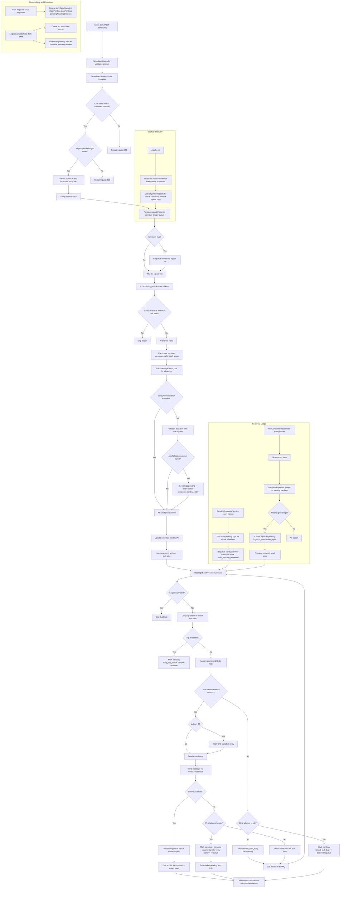

# Scheduling Workflow Flowchart

This diagram shows the end-to-end scheduling and delivery workflow, including queueing, retries, lock-based anti-ban behavior, reconciliation loops, and observability.

